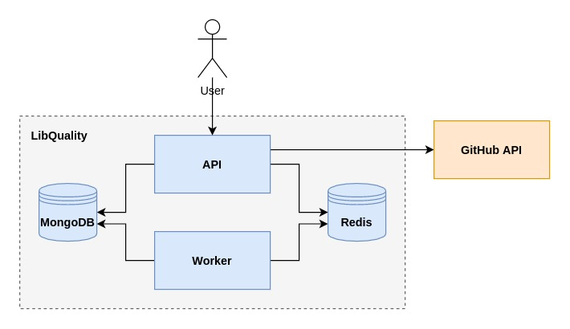

# LibQuality API

Only the phase 1 was implemented.

> **Phase 1**
>
> Product Owner wants to know how many issues are currently opened for a given GitHub project and how long the issues are opened. Basically, the bottom table in the wireframe. Besides that, LibQuality should keep track of searches by project and by user visit. These data will be used later to create new features, however, in Phase 1 it should start being collected.
>
> **Phase 2**
>
> Product Owner wants users to be able to see statistics about a set of libraries (that they choose) along time, day over day. In other words, a line chart should be displayed to end-users so they can see how the library team is handling their issues along project life.
>
> **Phase 3 (not for implement in this test, only use as requirement when designing architecture)**
>
> Product Owner envision seeing other metrics like stars, forks, #contributors, and also allow users to see issues grouped by GitHub labels. We enforce that users will start to make requests after Phase I.


## Setup

The following application are needed to be in the environment:

* Node.js (with yarn)
* MongoDB
* Redis

Then, install and build the application.

```
yarn install
yarn build
```

Setup the following environment variables:

* `NODE_ENV` Environment (defined at `.env`.)
* `PORT` Port (defined at `.env`.)
* `DATABASE_URL` MongoDB address (defined at `.env`.)
* `REDIS_URL` Redis address (defined at `.env`.)
* `MAX_CONCURRENT_JOBS` The number of parallel jobs (defined at `.env` as `5`).
* `GITHUB_ACCESS_TOKEN` The GitHub access token is mandatory and is not defined at `.env`.

Run the worker:

`yarn workers`

And run the API:

`yarn start`

The documentation can be found at `http://localhost:<PORT>/docs`.

### With Docker Compose

The same can be achieved using `docker-compose`:

```
sudo docker-compose up
```

_The environment variable `GITHUB_ACCESS_TOKEN` is still mandatory._


## Testing

Command to run the tests:

```
yarn test
```


## Assumptions

* The user will request the repository directly using the owner name and repository name in the following format: `<owner>/<name>` (e.g. `facebook/react`.)

* It's okay to have data eventually out of date for a short period of time.


## Architecture



The system contains an API that serves the repositories data, a worker to take care of keeping the data up to date, a MongoDB instance as the database, and a Redis instance for queueing tasks.


### API

The API benefits from the separation of concerns and dependency injection. The HTTP layer concerns are reading and parsing parameters, and preparing the response only. The business logic is concentrated in the service layer, which is reusable.

The API structure is the following:

* `/config` Configuration and initialization.
  * Provide environment variables.
  * Initialize the GitHub API client.
  * Swagger UI configuration.
  * Injections.
  * Logger configuration.
  * Tests configuration.
* `/constants` Any kind os constants.
* `/endpoints` Every API end-point grouped by resource.
  * Repositories resource with an end-point to fetch a repository by its identification.
* `/helpers` Helper functions.
* `/loaders` Start up steps.
  * App initialization.
  * Database initialization.
  * Workers initialization (not used by the API.)
* `/middlewares` Express middlewares.
  * Error handling.
* `/models` Models.
  * Repository model.
* `/services` Service layer.
  * The repository service that provides methods to fetch and update repositories.
  * The host service that provides methods to fetch repository information from the GitHub API.
* `/workers` Workers.
  * The worker to update repositories information in the database.


### Workers

The need for the worker is described in the ADR called Fetch Repository Worker that can be found at [/docs/adr/fetch-repository-worker.md](./docs/adr/fetch-repository-worker.md). The workers share the same code base from the API.


### MongoDB

The MongoDB was choosen as the database because ACID is not a priority. The system keeps information provided by a third party which is actually the single source of truth, so the database serves only as a way to quickly access processed data.


### Redis

The Redis is used for queueing tasks. Is known that the MongoDB can also be used for this purpose but Redis was still used becuase of familiarity and the possibility of using it for caching in the future.


## Developement

The development process were separated in 3 steps: MVP, persistence, and optimization. The services and the helpers are the only files been tested. Every commit that created or changed one of these files had tests created or updated. The testing wasn't expanded for the rest of the API, mainly end-points and loaders, because of the lack of time.

To keep code quality, the project used git hooks to fix the code style and run tests.


### MVP

The MVP was a system that could provide all the information required in the first phase, no matter how. The end-point was implemented and could fetch the repository information, the repository issues, and calculate the issues statistics without persisting the data.

The end-point can be very slow and probably result in timeouts on the client side.


### Persistence

Since the requests could take too long and there was no problem to have outdated information for a short period of time, the repository information were fetched from the GitHub API only once per hour. Other requets for the same repository would give the stored information.

The problem pointed in the MVP section still exists but happens less times.


### Optimization

The fetching of repository information from the GitHub API was moved to a worker so the end-point can respond immediatly and update the repository information in parallel. More details [here](./docs/adr/fetch-repository-worker.md).

This is not an ideal solution since the update is triggered only when the user reaches the API. No matter how long the repository information is out of date, the request that triggers the update will receive this data.

An ideal solution could be the worker been configured to run independently. So it would update repositories that have a high rate of searches. There is still a concern about how many repositories it could update without abusing the rate limit of the GitHub API.
